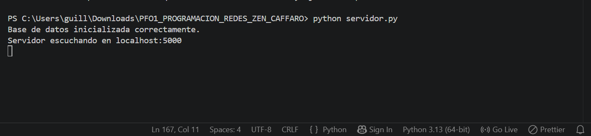
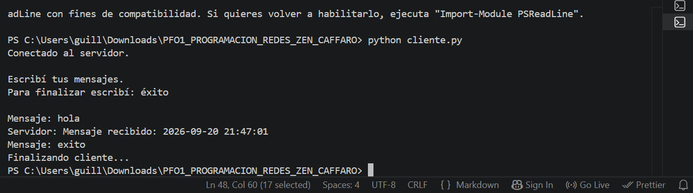
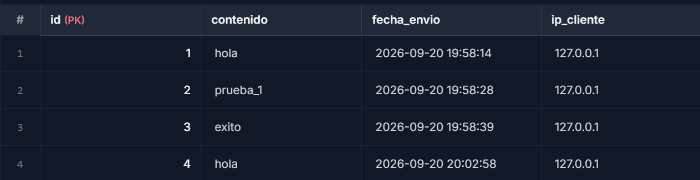
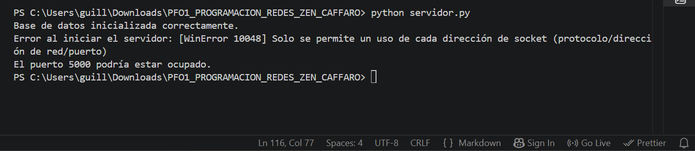
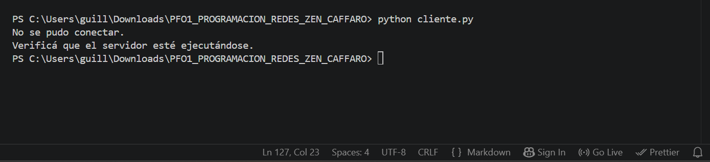

**PFO1 - Implementación de un Chat Básico Cliente-Servidor con Sockets y Base de Datos**

Alumna: Guillermina Zen Cáffaro
Materia: Programación de Redes
Tecnicatura en Desarrollo de Software - ITF N°29

**Descripción:**

Este proyecto implementa un chat básico cliente-servidor en Python utilizando sockets TCP/IP y una base de datos SQLite.
El servidor escucha conexiones en localhost:5000, recibe mensajes enviados por el cliente, los guarda en una base de datos y responde con la fecha y hora en que fueron recibidos.
El cliente puede enviar múltiples mensajes y finaliza cuando el usuario escribe éxito o exito.


**Estructura del proyecto:**
```
PFO1_PROGRAMACION_REDES_ZEN_CAFFARO/
├── servidor.py
├── cliente.py
├── README.md
└── imagenes/
    ├── base_datos.png
    ├── cliente_sin_servidor.png
    ├── iniciar_cliente.png
    ├── iniciar_servidor.png
    └── puerto_ocupado.png
```
El archivo mensajes.db se crea automáticamente al ejecutar el servidor por primera vez.


**Requisitos:**

- Python 3
- No se requieren librerías externas.

El proyecto utiliza módulos incluidos en Python:
- socket
- sqlite3
- datetime


**Ejecución:**

1. Iniciar el servidor
Abrir una terminal dentro de la carpeta del proyecto y ejecutar: *python servidor.py*
Si todo funciona correctamente, se mostrará:

Base de datos inicializada correctamente.
Servidor escuchando en localhost:5000




2. Iniciar el cliente
Abrir una segunda terminal en la misma carpeta y ejecutar: *python cliente.py*
El cliente mostrará:

Conectado al servidor.

Escribí tus mensajes.
Para finalizar escribí: éxito

A partir de ese momento se pueden enviar varios mensajes.

Ejemplo:
**Mensaje: Hola**
**Servidor: Mensaje recibido: 2026-09-20 20:30:15**

Para finalizar el cliente se puede escribir: éxito o exito




**Base de datos**

Los mensajes se guardan en la base de datos SQLite `mensajes.db`.

| Campo | Tipo | Descripción |
|---|---|---|
| `id` | INTEGER | Identificador único del mensaje. Se genera automáticamente. |
| `contenido` | TEXT | Contenido del mensaje enviado por el cliente. |
| `fecha_envio` | TEXT | Fecha y hora en que se recibió el mensaje. |
| `ip_cliente` | TEXT | Dirección IP del cliente que envió el mensaje. |




**Funcionamiento general**
```
CLIENTE
   |
   | mensaje
   v
SERVIDOR localhost:5000
   |
   | guarda el mensaje
   v
SQLite - mensajes.db
   |
   | respuesta con timestamp
   v
CLIENTE
```

**Manejo de errores**

El proyecto contempla distintos errores básicos:
- Puerto 5000 ocupado al iniciar el servidor.
- Error de acceso o escritura en la base de datos.
- Intento del cliente de conectarse cuando el servidor no está ejecutándose.
- Pérdida o cierre de la conexión entre cliente y servidor.


**Pruebas realizadas**

Funcionamiento normal:
1- Ejecutar servidor.py.
2- Ejecutar cliente.py en otra terminal.
3- Enviar varios mensajes.
4- Verificar que el servidor responda a cada uno.
5- Comprobar que los mensajes se guarden en mensajes.db.

**Puerto ocupado**

Con un servidor ya ejecutándose, abrir otra terminal y ejecutar nuevamente: python servidor.py
El segundo servidor debe informar que no pudo iniciar porque el puerto puede estar ocupado.




**Cliente sin servidor**

Cerrar el servidor y ejecutar: python cliente.py
El cliente debe informar que no pudo conectarse y solicitar verificar que el servidor esté ejecutándose.




**Finalización del servidor**

Para detener el servidor desde la terminal: Ctrl + C
El programa finalizará de forma ordenada.